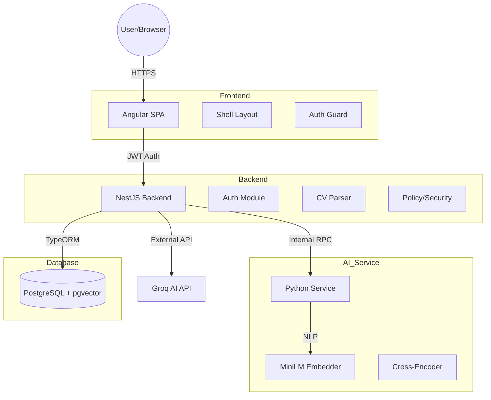

# 2. REAL SYSTEM ARCHITECTURE

This document describes the actual architecture of the BIAT TalentOS platform based on the current implementation.

## Architectural Pattern: Three-Tiered Containerized Micro-Monolith

The system follows a classic client-server architecture, decoupled into three specialized services orchestrated via Docker.

### 1. Frontend (Angular 18 SPA)
*   **Pattern**: Single Page Application (SPA) using Standalone Components.
*   **State Management**: `BehaviorSubject` based reactive state in core services (e.g., `AuthService`, `ChatStateService`).
*   **Styling**: Vanilla SCSS with a custom glassmorphism design system.
*   **Communication**: REST API calls to the NestJS backend via `HttpClient`.

### 2. Backend (NestJS Modular Monolith)
*   **Framework**: NestJS (TypeScript) with Dependency Injection.
*   **ORM**: TypeORM (Relational Mapping) with Raw SQL where performance or specific features (pgvector) are required.
*   **Modules**: Feature-based modularization (Candidates, Employees, Job-Architecture, etc.).
*   **Authentication**: JWT-based stateless authentication with Passport.js.

### 3. AI & Data Pipeline (Python FastAPI Microservice)
*   **Role**: Specialized NLP and Vector processing.
*   **Stack**: FastAPI (Python), Sentence-Transformers (Embeddings), Cross-Encoders (Reranking), pdfplumber (Text Extraction).
*   **Interaction**: The NestJS backend acts as an orchestrator, sending PDF data (base64) or text to this service and receiving structured embeddings or raw text.

## Data Flow (Request Lifecycle)

### CV Parsing Flow
1.  **Frontend**: User uploads PDF. Component converts it to Base64.
2.  **NestJS**: Controller receives request, passes it to `CvUploadService`.
3.  **Python Service**: Receives Base64, extracts text via `pdfplumber`, returns raw text to NestJS.
4.  **NestJS**: Passes raw text to `AiCvParserService`, which calls **Groq API** (Llama-3) to extract structured JSON.
5.  **PostgreSQL**: Structured data saved to `cv_parsed_data` and `candidates` tables.

### AI Search Flow
1.  **Frontend**: User enters query in Chatbot.
2.  **NestJS**: Calls `ChatbotService.recommend`.
3.  **Python Service**: Generates a 384-dimensional vector embedding of the query string.
4.  **PostgreSQL**: Performs a Vector Similarity search (`<=>` operator) against candidate embeddings.
5.  **NestJS**: Sends top matches + query to **Groq API** to generate a natural language narrative explanation of why these candidates match.
6.  **Frontend**: Renders matches with match scores and the AI's explanation.

## Component Interaction Diagram (Inferred)

## Security Architecture
*   **JWT Barrier**: All protected routes require a valid Bearer Token.
*   **RBAC (Role Based Access Control)**: Enforced at the controller level via `RolesGuard`.
*   **ABAC (Attribute Based Access Control)**: Enforced in the service layer via `PolicyService`, checking attributes like `hiring_manager` and `department_id` to scope data access for managers.
